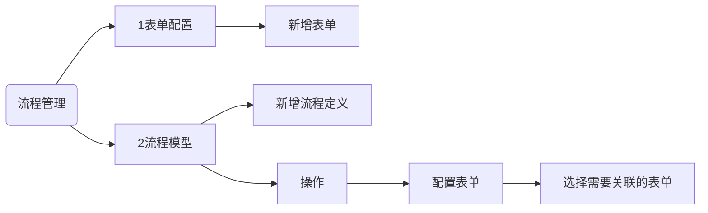
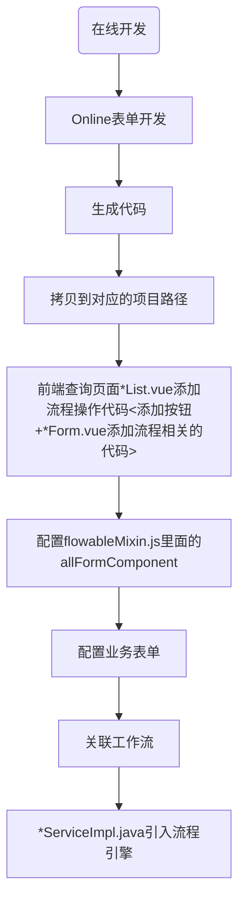

# 流程文档

## 1.  表单配置【sys_form】

## 2. 流程模型

> 数据来源：流程定义列表数据查询ProcessDefinitionQuery 获取到 流程定义ProcessDefinition集合 = sys_form系统流程表单、sys_custom_form系统自定义表单表
>
> 
# 1. web定义表单的流程
```sql
-- 流程定义列表数据查询ProcessDefinitionQuery 
SELECT DISTINCT RES.* FROM ACT_RE_PROCDEF RES ORDER BY RES.DEPLOYMENT_ID_ DESC LIMIT 15 OFFSET 0
```



# 2. 自己进行定义的业务流程


